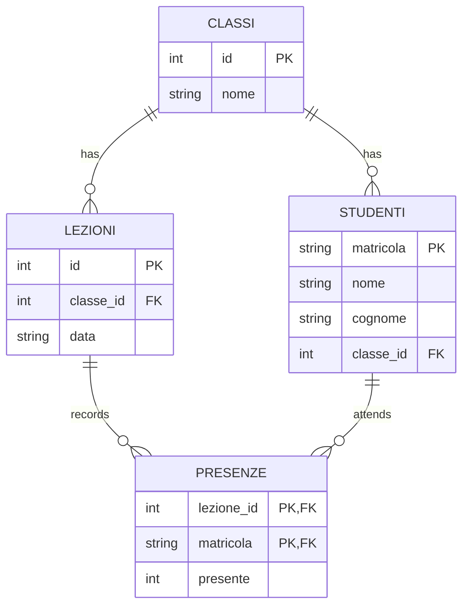

# Registro Presenze SIGI

App desktop sviluppata con **Electron** e **Node.js** per gestire classi, studenti, lezioni e presenze tramite qrcode, con database SQLite.

```mermaid
erDiagram
    CLASSI {
        int id PK
        string nome
    }
    STUDENTI {
        string matricola PK
        string nome
        string cognome
        int classe_id FK
    }
    LEZIONI {
        int id PK
        int classe_id FK
        string data
    }
    PRESENZE {
        int lezione_id PK,FK
        string matricola PK,FK
        int presente
    }

    CLASSI ||--o{ STUDENTI : has
    CLASSI ||--o{ LEZIONI : has
    LEZIONI ||--o{ PRESENZE : records
    STUDENTI ||--o{ PRESENZE : attends
```
